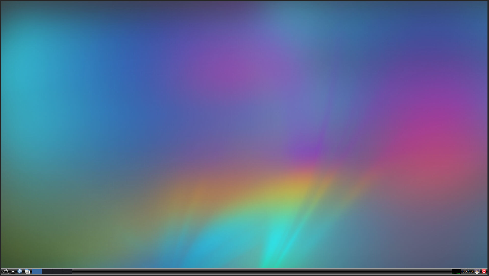

# Installation
Please follow the following to setup [Butler](https://sahibdhanjal.github.io/butler/) on your system

## Ubuntu or OS-X
If on Ubuntu, proceed as follows:

```bash
git clone https://github.com/sahibdhanjal/butler.git

# install basic system dependencies
. scripts/provision install

# build the ROS/Gazebo development container
. scripts/provision build ros

# build the nvidia development container ( optional )
. scripts/provision build nvidia
```

Run the **ROS container** using `. run ros`, which automatically starts a session in your web browser at [localhost:6080](http://localhost:6080/). You can now use this browser tab as a VNC terminal something as follows:



Your local folder is directly mapped to the folder in the docker container, so any change you make will automatically reflect there. You can also optionally view the same using a VNC Client at [localhost:5900](http://localhost:5900/). These ports can also be changed by providing them when running the command as `. run ros <browser_port> <vnc_port>`. For example, launching `. run ros 10001 5902` launches the browser client at [localhost:10001](http://localhost:10001/) and the VNC client at [localhost:5902](http://localhost:5902/). Note that you cannot view the vnc port in the browser and vice-versa

Run the **nvidia container** using `. run nvidia`, which opens up a terminal inside the docker itself. An optimized version of cuda and pytorch have been setup inside this environment and it is highly suggested to use the environment inside for any testing, training, inference purposes.

## Windows
If on Windows (not recommended for development), proceed as follows:
1. Clone or download the [repository](https://github.com/sahibdhanjal/butler.git)
2. Install [docker](https://docs.docker.com/docker-for-windows/install/) for windows
3. Install [google chrome](https://www.google.com/chrome/)
4. Install the latest [nvidia](https://www.nvidia.com/Download/index.aspx) driver supported by your card
5. Open a command prompt and type the following in the root directory of the repository:

```bash
# build the ROS/Gazebo development container
docker build scripts/ros_container -t butler-ros:latest

# build the nvidia development container ( optional )
docker build scripts/nvidia_container -t butler-nvidia:latest
```

Run the containers as follows:
```bash
# run the ROS/Gazebo container
docker run --rm -p 6080:80 -e RESOLUTION=1920x1080 -it butler-ros:latest

# run the nvidia container
docker run --gpus all --privileged --ipc=host -it butler-nvidia:latest
```
The ROS container will automatically start a VNC session in your web browser at [localhost:6080](http://localhost:6080/)
